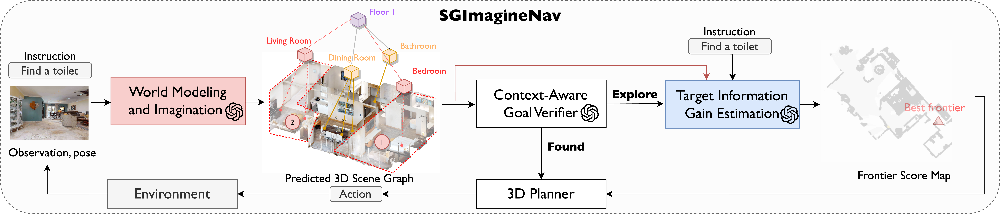

# Imaginative World Modeling with Scene Graphs for Embodied Agent Navigation

[**Video**](https://www.youtube.com/watch?v=zwx96VJfb2A)

We proposed a new framework to explore and search for the language descriptive targets in unknown environment based on Large Vision Language Model. Our work is based on [Concept-Graph](https://github.com/concept-graphs/concept-graphs?tab=readme-ov-file), [L3MVN](https://sites.google.com/view/l3mvn), and [VLN GAME](https://github.com/ybgdgh/VLN-Game), implemented in PyTorch.


## Abstract

Semantic navigation requires an agent to navigate toward a specified target in an unseen environment. Employing an imaginative navigation strategy that predicts future scenes before taking action, can empower the agent to find target faster. Inspired by this idea, we propose SGImagineNav, a novel imaginative navigation framework that leverages symbolic world modeling to proactively build a global environmental representation. SGImagineNav maintains an evolving hierarchical scene graphs and uses large language models to predict and explore unseen parts of the environment. While existing methods solely relying on past observations, this imaginative scene graph provides richer semantic context, enabling the agent to proactively estimate target locations. Building upon this, SGImagineNav adopts an adaptive navigation strategy that exploits semantic shortcuts when promising and explores unknown areas otherwise to gather additional context. This strategy continuously expands the known environment and accumulates valuable semantic contexts, ultimately guiding the agent toward the target. SGImagineNav is evaluated in both real-world scenarios and simulation benchmarks. SGImagineNav consistently outperforms previous methods, improving success rate to \textbf{65.4\%} and \textbf{66.8\%} on HM3D and HSSD, and demonstrating cross-floor and cross-room navigation in real-world environments, underscoring its effectiveness and generalizability.




## Installation

The code has been tested only with Python 3.10, CUDA 12.1. We also provide docker containers to run the Object-Goal Navigation task, or install all the packages manually to run all tasks.

### Docker Setup
See [sg_vln container readme](./docker/).

### Manual Installation
- Setup the conda environment as Python3.10 + CUDA12.1 + PyTorch2.1.0.
    ```
    conda create -n sg_vln anaconda python=3.10
    conda activate sg_vln
    pip install torch==2.1.0 torchvision==0.16.0 torchaudio==2.1.0 --index-url https://download.pytorch.org/whl/cu121
    ```
- We use 0.2.1 versions of [habitat-sim](https://github.com/facebookresearch/habitat-sim) and [habitat-lab](https://github.com/facebookresearch/habitat-lab) as specified below:

- Installing habitat-sim:
    ```
    git clone https://github.com/facebookresearch/habitat-sim.git
    cd habitat-sim; git checkout tags/v0.2.1; 
    pip install -r requirements.txt; 
    python setup.py install --headless
    python setup.py install # (for Mac OS)
    ```

- Installing habitat-lab:
    ```
    git clone https://github.com/facebookresearch/habitat-lab.git
    cd habitat-lab; git checkout tags/v0.2.1; 
    pip install -e .
    ```

- Install Open3D for visualization: 

    ```
    pip install "git+https://github.com/facebookresearch/pytorch3d.git@stable"
    ```

- Install [Ground-SAM](https://github.com/IDEA-Research/Grounded-Segment-Anything):
    ```
    # Grounded-SAM
    export AM_I_DOCKER=False
    export BUILD_WITH_CUDA=True
    export CUDA_HOME=/path/to/anaconda3/envs/sg_vln/ #if you use the cluster to load the CUDA, you can check the path by "module show CUDAxxx"

    git clone git@github.com:IDEA-Research/Grounded-Segment-Anything.git
    cd Grounded-Segment-Anything
    python -m pip install -e segment_anything
    python -m pip install -e GroundingDINO # delete pyproject.toml if building failure due to the cuda verson mismatch (link: https://github.com/vllm-project/vllm/issues/129#issuecomment-1805088950)

    #download
    wget https://dl.fbaipublicfiles.com/segment_anything/sam_vit_h_4b8939.pth
    wget https://github.com/IDEA-Research/GroundingDINO/releases/download/v0.1.0-alpha/groundingdino_swint_ogc.pth

    ```

- Clone the repository and install other requirements:
    ```
    git clone https://github.com/tccoin/SG-VLN
    cd SG-VLN
    pip install -r requirements.txt
    ```


### Prepare Datasets

Create a `data` folder in `SG-VLN` path
```
mkdir data
cd data
```

#### Habitat Matterport
Download [HM3D_v0.1](https://aihabitat.org/datasets/hm3d/) dataset using download utility and [instructions](https://github.com/facebookresearch/habitat-sim/blob/main/DATASETS.md#habitat-matterport-3d-research-dataset-hm3d):
```
python -m habitat_sim.utils.datasets_download --username <api-token-id> --password <api-token-secret> --uids hm3d_val_habitat
```

#### Download Language description datasets

Download the [vlobjectnav_hm3d](https://drive.google.com/file/d/1fhXwBuGUOhF2jjW0ThtE_6rh_P3YQClj/view?usp=sharing) and unzip it in data/datasets path.


#### Setting up datasets

You can use `scripts/setup_dataset.sh` to setup the datasets.

The code requires the datasets in a `data` folder in the following format:
```
SG-VLN/
  data/
    scene_datasets/
    versioned_data/
    datasets/
        objectgoal_hm3d/
        vlobjectnav_hm3d/
```

The `objectgoal_hm3d` is used for object-goal navigation, and `vlobjectnav_hm3d` is used for language descriptive target navigation.


## Run SG-VLN: 

The following commands should be run in the conda environemnt:
```
export GSA_PATH=/path/to/Grounded-Segment-Anything
```

#### Object-goal navigation
For evaluating the object-goal navigation task, run:
For multiprocessing, run:
```
python main_vis_vec.py
```

See `arguments.py` for all arguments.

<!-- ## Citation


If you find this project helpful for your research, please consider citing the following BibTeX entry.
```
@article{yu2024vlngame,
  title={VLN-Game: Vision-Language Equilibrium Search for Zero-Shot Semantic Navigation}, 
  author={Bangguo Yu, Yuzhen Liu, Lei Han, Hamidreza Kasaei, Tingguang Li, and Ming Cao},
  journal={arXiv:2411.11609},
  year={2024}
}
``` -->